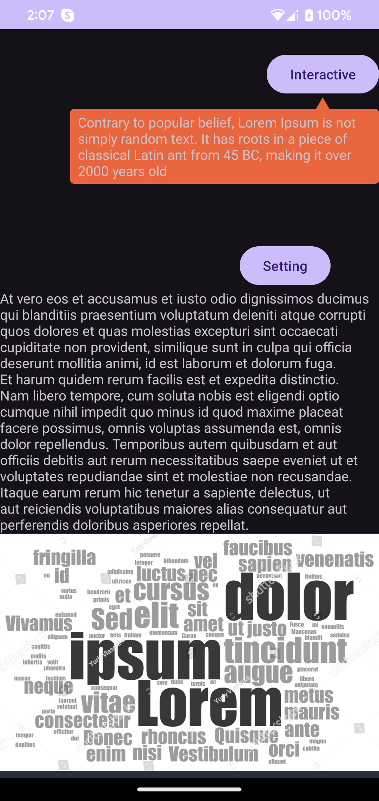

# TOOLTIP
## Setting things up

*<u>First step</u>*
<br>
To start using this, add to your root build.gradle at the end of repositories. If you are using Groovy
```gradle
dependencyResolutionManagement {
	    repositoriesMode.set(RepositoriesMode.FAIL_ON_PROJECT_REPOS)
		repositories {
			mavenCentral()
			maven { url 'https://jitpack.io' }
		}
	}
```
Or if you are using .kts then it might be added in the settings.gradle.kts:
```kts
maven("https://jitpack.io")
```

*<u>Second step</u>*
<br>
Then add the depencency
```gradle
dependencies {
	        implementation 'com.github.dzungvu:tooltips:Tag'
	}
```

You can find the latest release version here https://github.com/dzungvu/tooltips/releases

## Usage
*<u>First step:</u>* <br>
Using ```TooltipView.TooltipBuilder()``` for creating instance of tooltip:
```kotlin
private fun buildTooltipView(content: String, tooltipPosition: TooltipView.TooltipPosition = TooltipView.TooltipPosition.BOTTOM): TooltipView {
        return TooltipView.TooltipBuilder()
            .setContent(content)
            .setAnchorPosition(tooltipPosition)
            .setContentLayoutId(R.layout.custom_tooltip_content)
            .setArrowResId(R.drawable.arrow)
            .setTooltipDismissListener(TooltipView.TooltipDismissListener {
                Toast.makeText(this, "Tooltip dismissed", Toast.LENGTH_SHORT).show()
            })
            .setDismissStrategy(TooltipView.DismissStrategy.DISMISS_WHEN_TOUCH_INSIDE)
            .build(context = this)
    }
```

- ```setContent(string)```: Setting tooltip text content <br>
- ```setAnchorPosition```: The tooltip will display on top/bottom or the anchor view (```TooltipView.TooltipPosition.TOP``` or ```TooltipView.TooltipPosition.BOTTOM```)<br>
- ```setContentLayoutId```: Customize the tooltip content layout. This layout must contain a TextView with id ```tv_tooltip_content```<br>
- ```setArrowResId```: Custom drawable image for the arrow, which is the pointer point to the anchor view
- ```setTooltipDismissListener```: When the tooltip is dismissed, this callback will be executed
- ```setDismissStrategy```: Define how a tooltip should be dismissed. The default strategy is tap on the tooltip. Now it's support ```DismissStrategy.DISMISS_WHEN_TOUCH_INSIDE``` and ```DismissStrategy.DISMISS_WHEN_TOUCH_OUTSIDE```
- ```setBackgroundColorRes```: In case of using default tooltip layout, you can custom the tooptip background color

Then, end up with ```build(context)``` function to create a tooltip view.


*<u>Second step</u>*
Display the tooltip:
```kotlin
val tooltipHello = buildTooltipView("Where to hello?", TooltipView.TooltipPosition.TOP)
tvHello.showTooltip(tooltipHello)

```


